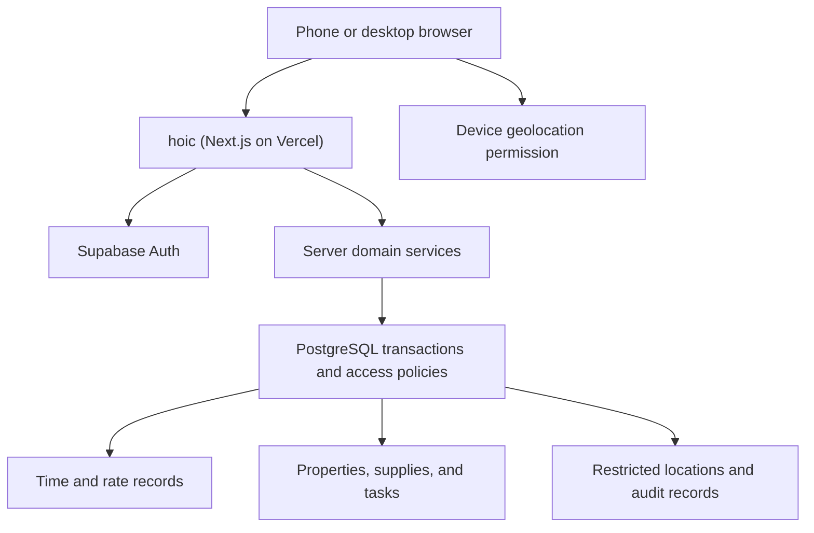

# hoic — Requirements and Architecture

Version 1.0 · October 3, 2026 · Design for review and implementation

## 1. Purpose and scope

Build hoic, a private, mobile-first app for a small house renovation crew: Christian, his boss, and roughly four coworkers. The crew guts, remodels, and repairs properties for resale or rental. hoic should replace scattered messages about hours, forgotten supply requests, and verbal task assignments.

Success means a worker can quickly record a shift, see their hours and estimated earnings, know what to work on, and add supplies needed. The boss can assign work, review hours, and coordinate purchases. Christian can administer accounts and inspect location recorded at clock-in and clock-out.

hoic is a single-crew application, not a public service marketplace or a payroll processing system. It has no customer payments, advertising, public signup, taxes, or payment transfers.

### Confirmed requirements

- Clock in and clock out; show recorded hours and estimated pay using hours × hourly rate.
- Attempt location capture at clock-in and clock-out; location details appear only in Christian's admin view initially.
- Shared supplies list that all crew members can contribute to.
- Per-worker task assignments created by the boss, visible to the assigned worker.
- Small scale, low ongoing cost, usable from phones.
- Use Vercel Hobby as the accepted hosting assumption for this design, following the user's eligibility research. This document does not revisit that decision.

### Proposed defaults

These are design choices, not facts supplied by the user. They can be changed before implementation.

| Topic | Default |
|---|---|
| Backend | Supabase Free for PostgreSQL and authentication |
| Frontend | Next.js App Router, TypeScript, Tailwind CSS, shadcn/ui |
| Currency and timezone | USD; America/Chicago |
| Reporting week | Monday 00:00 through the following Monday 00:00, local time |
| Crew visibility | All active members can see active properties and shared supplies; workers see only their own time, rates, earnings, and assignments |
| Boss access | Foreman role: all crew time/rates and task management; no location access by default |
| Christian's access | Admin role, plus the same worker features as everyone else |
| Breaks | Explicit unpaid break start/end; no automatic lunch deduction |
| Estimated pay | Straight time only; no overtime multiplier, deductions, or claim to calculate legally owed wages |
| Location unavailable | Accept the clock event and record why location is missing |
| Offline | No silently queued clock events in version one |
| Rate changes | Effective at the next shift; historical shifts retain their original rate |

## 2. Release scope

### First usable release

1. Private accounts, role-based access, and account deactivation.
2. Property/job records, address, status, and basic instructions.
3. Clock-in/out, unpaid breaks, personal history, and weekly estimated earnings.
4. Foreman timesheet review, worker correction requests, and audited corrections.
5. Optional event location capture and admin-only inspection.
6. Shared supplies with quantity, urgency, property, and purchase status.
7. Assigned tasks with priority, status, and completion notes.
8. Weekly CSV export and a documented backup/restore procedure.

### Later additions

- Compressed progress photos, before/after sets, and receipt attachments.
- Short daily work notes and property punch lists.
- In-app reminders for open shifts and overdue tasks.
- Tool checkout: who has the ladder, drill, or other shared equipment.
- Mileage or reimbursement records, kept separate from hourly earnings.
- True offline capture with conflict resolution, if poor connectivity proves common.

Keep native apps, continuous location tracking, automatic geofencing enforcement, SMS, full chat, inventory accounting, and payroll integrations outside the initial release.

## 3. Roles and access

Roles are additive in behavior: foremen and admins can still clock in and view their own assignments. Separate location access from ordinary crew management.

| Capability | Worker | Foreman / boss | Admin / Christian |
|---|---|---|---|
| Clock self in/out; record own breaks | Yes | Yes | Yes |
| View own time and estimated earnings | Yes | Yes | Yes |
| View other workers' time/rates | No | Yes | Yes |
| Request correction to own shift | Yes | Yes | Yes |
| Correct or void time with a reason | No | Yes | Yes |
| View clock-event coordinates | No | No initially | Yes |
| View active properties | Yes | Yes | Yes |
| Create/archive properties | No | Yes | Yes |
| Add and update shared supplies | Yes | Yes | Yes |
| Create/assign/reassign tasks | No | Yes | Yes |
| Update assigned task status/notes | Own assignments | All | All |
| Manage accounts and roles | No | No | Yes |
| Export all crew timesheets | No | Yes | Yes |

Do not expose pay rates, coordinates, or other workers' records in a response and merely hide them with CSS. Restrict the query and returned fields. A minimal active-member directory may expose names and IDs for assignment without exposing financial data.

## 4. Worker and boss experience

### Worker home

Show the selected property, a large clock button, current shift state, today's recorded hours, weekly hours/estimated earnings, assigned tasks, and a supplies shortcut. A running timer is a display derived from the persisted start timestamp, not a backend process.

While working, show Start unpaid break or End break. Clock-out asks for optional notes and confirms saved time. Display success only after the server has committed the event. Keep buttons accessible, readable outdoors, and large enough to use on a phone.

### Worker navigation

Home · My time · My tasks · Supplies. Property selection is available from Home and relevant lists. Profile includes timezone display, location explanation, and logout.

### Foreman view

Overview lists who is working, on break, or clocked out, and at which property. Provide a weekly timesheet, correction queue, task assignment form, and supplies grouped by property and urgency. Show stale open shifts as needing review rather than automatically closing them.

### Admin view

Include foreman tools, account management, rate history, and event location inspection. Location inspection shows event type, captured time, coordinates, reported accuracy, and a link to open the point in a maps app. An embedded map is unnecessary in version one.

## 5. Timekeeping requirements and rules

### State and concurrency

- Each member may have at most one open shift across all properties.
- A shift has states working, on_break, closed, or voided.
- Only one break may be open at a time; every break must remain within its shift.
- Clock-out during a break ends the break and shift in one transaction.
- A worker selects an active property at clock-in. Changing properties requires clock-out followed by a new shift; this keeps labor attribution clear.
- Admin/foreman corrections cannot create overlapping, non-voided shifts for one worker.
- Enforce invariants in PostgreSQL transactions, constraints, and locking, not just disabled buttons.
- Assign a UUID operation key to every mutation. Retry with the same key after a timeout; the server returns the original result rather than creating another event. Reusing a key with different input is rejected.

### Authoritative time

Normal clock events use database/server time. Client timestamps may be recorded as diagnostic input but cannot determine paid time. Refreshing, closing the browser, or switching phones does not stop a shift.

Store timestamps as UTC instants using PostgreSQL timestamptz. Convert to the configured crew timezone for calendar views. Elapsed duration uses actual instants, including across daylight-saving changes.

### Duration and earnings

Paid seconds = shift elapsed seconds − unpaid break seconds. Calculate with full precision; display hours to two decimals without using that rounded display value to calculate money. Use integer cents for hourly rates and decimal arithmetic for prorated earnings. Round each closed shift's estimated earnings to the nearest cent, then sum those values.

At clock-in, snapshot the worker's applicable rate in the shift. Changes to future rates must not alter historical estimates. A historical rate correction is a separate audited edit requiring a reason.

Completed shifts determine the recorded earnings total. An active shift's live estimate appears separately. A shift crossing a reporting boundary is split into elapsed segments for weekly hours, subtracting breaks from the correct segment. Allocate its rounded earnings across those segments with a consistent remainder rule so period totals reconcile to the shift total.

Example: 08:00–16:30 with a 30-minute unpaid break is 8 paid hours. At $25/hour, estimated gross earnings are $200.

### Corrections

Workers submit requested times/break changes and a reason. Foreman/admin approves or rejects. Approval atomically updates the shift, validates all invariants, resolves the request, and writes an immutable audit record with actor, original values, new values, reason, and time.

Completed records are never hard-deleted through hoic; void with a reason instead. Preserve original clock events even after a correction. Corrections change the timesheet representation, not the observed event history or its original location.

## 6. Location capture

Explain before the first request: location is attempted only when clocking in/out and visible only to the hoic administrator initially. “Hidden” means restricted in hoic, not undisclosed collection.

Use the browser Geolocation API over HTTPS with explicit permission. Capture a fresh point for each clock event, with a bounded wait (proposed: eight seconds) and no background watching. Store capture time and reported accuracy. Save statuses such as captured, denied, timeout, unsupported, or unavailable.

Retain a coarse point by rounding coordinates to three decimal places before submission, roughly a neighborhood/building-block scale; longitude resolution varies by latitude. Never transmit the original precise coordinates. Reported accuracy describes the source reading, not a guarantee that the rounded point is exact. Do not infer an exact job address from a coarse point.

Failure to obtain location must not prevent clocking. If permission was denied, show that clocking succeeded without location. Device-supplied location can be inaccurate or manipulated and is not definitive attendance proof.

Store location in a separate admin-restricted table, not alongside worker-readable shift columns. Proposed retention: 90 days for coordinates, independently of time records. A periodic purge removes expired coordinates. Manual corrections never invent a location for the corrected time.

## 7. Properties, supplies, and tasks

### Properties

Fields: name, address, optional notes, status (active/archived), creator, timestamps. Archive preserves historical shifts/tasks/supplies and prevents new clock-ins or assignments. If a property still has open shifts, resolve those before archiving.

### Supplies

Fields: property, item name, quantity, unit, optional details, urgency, requester, status, claimed buyer, timestamps, and version number.

Workflow: needed → claimed → purchased. Claimed items name the intended buyer to reduce duplicate purchases. Release a claim back to needed; cancel obsolete requests without deleting history. All active members can contribute and mark purchases. No stock ledger or automatic reorder logic initially.

Use optimistic concurrency: an update supplies its known version; reject stale edits and refresh the current item rather than silently overwriting another user's change. Display similar existing requests as a convenience, but do not merge distinct supplies automatically.

### Tasks

Fields: property, title, description, assignee, priority, optional due date, creator, status, completion note, timestamps, and version.

Statuses: todo, in_progress, blocked, done, cancelled. A worker can update their own assignment and supply a blocked/completion note. Foremen can change scope, assignment, and priority or reopen a task. Proposed examples: caulk around windows; scrape and paint foundation; run new water lines.

Use the same version checks as supplies. Deactivated users cannot receive new assignments; retain and visibly flag their existing unfinished assignments for reassignment.

## 8. Architecture

### Recommended approach

A single Next.js application (hoic) provides pages and server actions; Supabase provides authentication and persistent PostgreSQL data. Keep domain logic in small server-side modules and transactional database functions. No separate API deployment, background worker, or microservice is needed.

| Alternative | Trade-off |
|---|---|
| Next.js + Supabase — selected | Cohesive authentication/database setup and database access policies; fits the crew's features |
| Next.js + Neon | Viable PostgreSQL alternative; would require adapting auth, access policies, and transactional interfaces |
| React SPA + hosted backend | Viable, but offers no clear advantage over the user's familiar Next.js workflow here |



### Responsibilities

| Module | Responsibility |
|---|---|
| Identity/access | Verified session, active membership, current role, authorized account administration |
| Timekeeping | Shift/break transitions, correction workflow, atomic invariants, idempotency |
| Earnings/reporting | Duration calculations, historical rates, reporting periods, CSV export |
| Properties | Active jobs, archive rules, address and instructions |
| Supplies | Shared requests, buyer claims, statuses, stale-edit protection |
| Tasks | Assignment, lifecycle, worker notes, stale-edit protection |
| Location | Permission UX, coarse capture payload, restricted reads, retention |
| Audit | Append-only records for sensitive administrative changes |

Use server components for initial data reads, client components for interactive controls/geolocation, and server actions for ordinary mutations. Use route handlers for CSV downloads and a narrowly authenticated maintenance endpoint if retention is scheduled.

Refresh lists after successful mutations and on returning to hoic. Initial release does not depend on realtime subscriptions or constant polling. If needed, add a modest refresh interval only to an open foreman overview.

### Authentication and authorization

Use Supabase's cookie-based SSR integration with verified identity and session refresh. Every server action independently verifies identity and looks up active membership; page guards alone are insufficient. Never accept actor ID or role as authority from submitted input.

Invite-only provisioning: admin creates approved accounts through a server-only Auth Admin operation. Default to email/password with public signup disabled. Production onboarding/password recovery must use configured SMTP; do not rely on the restricted default email sender. Provider choice is an implementation setup decision; email volume for this crew is low. A social-login alternative can be chosen before building.

Use a user-scoped Supabase client for normal data operations so row-level security remains active. Privileged service credentials are reserved for provisioning and maintenance, never exposed to the browser. Database role checks read protected membership records rather than trusting worker-editable metadata. Deactivation must deny hoic data access even if an old authentication token remains valid.

Database functions for sensitive transitions must validate caller membership/role internally. If SECURITY DEFINER is needed, set a safe search path, revoke public/anonymous execution, grant only intended execution rights, and validate auth.uid(). Do not assume a privileged function automatically respects RLS.

## 9. Data model

Use UUID primary keys and created_at/updated_at timestamps where applicable. Retain a single crew record and crew_id on domain records for scoping; do not build multi-company onboarding or billing.

| Table | Core fields / purpose |
|---|---|
| crews | name, timezone, currency, reporting_week_start |
| members | auth_user_id, crew_id, display_name, role, active |
| hourly_rates | member_id, effective_from, cents_per_hour, created_by; append history |
| properties | crew_id, name, address, notes, status |
| shifts | crew_id, member_id, property_id, started_at, ended_at, rate_snapshot_cents, voided_at, version |
| breaks | shift_id, started_at, ended_at |
| clock_events | shift_id, member_id, event_type, server_recorded_at, operation_id; original immutable events |
| event_locations | event_id, rounded_latitude/longitude, source_accuracy_m, captured_at, status, expires_at |
| correction_requests | shift_id, requester_id, proposed_changes, reason, status, reviewer_id, reviewed_at |
| supply_items | crew_id, property_id, name, quantity, unit, urgency, status, requested_by, claimed_by, version |
| tasks | crew_id, property_id, assignee_id, title, description, priority, due_date, status, notes, version |
| audit_events | crew_id, actor_id, entity_type/id, action, before/after values, reason, recorded_at |
| mutation_receipts | crew_id, actor_id, operation_id, action, payload_hash, result_reference; retry deduplication |

Use foreign keys and cross-crew validation. Add a partial unique index for one non-voided open shift per member and one open break per shift. Use member-row locking to serialize clock/correction operations and prevent closed-shift overlap; every relevant function must take the same lock. Add indexes for member/time reports, property/status lists, assignee/status lists, and location expiry.

Keep pay fields out of public member-directory views. Any views must preserve the intended access policies. Audit access is foreman/admin, with location excluded from general audit payloads; otherwise audit records could bypass the separate location restriction.

## 10. Mutation contracts and data flow

Domain actions return a typed result: success with persisted record/version, or a stable error code with a user-readable message. Validate fields server-side (for example, using Zod), then enforce relational/time constraints in PostgreSQL.

| Action | Important input | Enforcement |
|---|---|---|
| clockIn | property_id, operation_id, optional location/status | Active member/property; applicable rate exists; no open/overlapping shift |
| startBreak / endBreak | shift_id, operation_id | Owned open shift; valid break transition |
| clockOut | shift_id, operation_id, optional location/status and note | Owned open shift; atomically close break if needed |
| requestCorrection | shift_id, proposed changes, reason | Own shift; request has valid structure |
| reviewCorrection | request_id, decision, expected shift version, reason | Foreman/admin; approval validates full timeline and writes audit |
| setHourlyRate | member_id, cents, effective_from, reason | Foreman/admin; append history; no silent retroactive rewriting |
| updateSupply | item_id, changes, expected_version | Active member; crew scope; valid claim/status transition |
| assign/updateTask | task_id or new fields, expected_version | Foreman/admin assigns; worker status updates limited to own task |
| exportTimesheet | reporting range, optional member/property | Own records or authorized crew-wide access |

Clock-in sequence: choose property → explain/request location if needed → send clock command → verify session/membership → transaction locks member and validates state → insert shift, original event, optional location, and receipt → commit → refresh UI from persisted state.

Clock data and its location status must be committed together. A network timeout after submission is an unknown outcome, not proof of failure. Retry using the same operation ID and reconcile from the persisted state.

## 11. Failures, privacy, and operational behavior

| Situation | Required behavior |
|---|---|
| Double-tap or two phones clock in | One shift; deduplicate same operation or report existing active shift |
| Connection fails before commit | Show unsaved state and retry; never fabricate a successful clock-in |
| Server commits but response is lost | Same-key retry retrieves outcome without changing timestamp |
| Phone clock is wrong | Use server timestamp; reports remain consistent |
| Worker forgets to clock out | Flag stale shift; submit/review correction; no guessed automatic end time |
| Location denied/slow | Save event with missing-location status |
| Session expires | Preserve ordinary form draft where practical, reauthenticate, re-read shift state before retry |
| Two people edit a supply | Reject stale version and display current item |
| Supabase unavailable/paused | Clear retry message; optional local note of attempted time for a later correction, explicitly unconfirmed |
| User deactivated | Deny subsequent domain actions and reads; keep historical records |

Apply HTTPS, server-side validation, restrictive RLS, and explicit field selection. Do not share-cache authenticated pages, exports, or session-bearing responses. Do not store authenticated content in a service-worker cache. Exclude credentials, rates, and coordinates from routine logs. Add origin checks appropriate to exported endpoints and retain framework protections for server actions.

For version one, the manifest/icons can support home-screen installation where the browser supports it. Any app-shell caching must be limited to public assets. True offline writes are deferred; show connection state and offer correction requests for missed events.

## 12. Repository and deployment

Suggested structure:

```text
src/app/                 Pages, layouts, server actions, export routes
src/components/          Shared UI controls and mobile navigation
src/features/time/       Timekeeping forms and server services
src/features/reporting/  Duration, earnings, period allocation, export
src/features/tasks/      Assignment workflow
src/features/supplies/   Shared list workflow
src/features/properties/ Property records
src/features/admin/      Accounts, roles, restricted locations
src/lib/supabase/        Browser/server clients and session refresh
src/lib/auth/            Verified identity and membership checks
src/lib/validation/      Input schemas and shared error contracts
supabase/migrations/     Tables, policies, indexes, transactional functions
tests/                   Domain, database, authorization, and end-to-end checks
docs/                    Setup, operating instructions, backup/restore
```

Deploy hoic on Vercel Hobby and use Supabase Free. Use the provided hosting subdomain initially; a custom domain is optional. Keep the application and database geographically close where available. Pin tested dependency versions and commit the lockfile.

Use a local Supabase instance or separate development project for migrations/tests. Preview deployments must not mutate real crew data. Configure production auth redirect URLs, SMTP, and secrets explicitly. Never copy the production service credential into browser variables.

A low-frequency authenticated retention job can purge expired location records. Do not use artificial traffic to defeat project inactivity rules. If automatic execution is not configured, the admin must run the documented purge; the UI must not imply the data has already been deleted.

Text data for this crew is small. Monitor database size, bandwidth, and function usage. Supabase Free currently lists 500 MB database storage and pauses inactive projects after a week; automatic backups are not included. Establish weekly database exports to a separate protected location, and test restoration before relying on hoic for records. Record the chosen backup owner and procedure at launch.

## 13. Build phases and acceptance criteria

| Phase | Deliverable | Acceptance gate |
|---|---|---|
| 1. Foundation | Accounts, roles, property setup, schema/policies, mobile navigation | Worker cannot access another worker's financial/time data; foreman cannot retrieve coordinates; deactivated account is denied |
| 2. Time and earnings | Clock/break flows, immutable events, rate snapshots, history | Concurrent/retried actions produce one valid result; pay examples and boundary cases reconcile |
| 3. Review and location | Coarse capture, correction queue, audit, export | Permission denial still clocks; correction preserves originals; stale corrections fail safely; CSV matches displayed totals |
| 4. Crew coordination | Supplies, claims, assigned tasks | Boss assigns and worker sees task; shared edits reject stale versions; purchased/claimed state is clear |
| 5. Pilot and operations | Real-device pilot, backup restore, retention, usage checks | Crew completes a trial week, compares records with its current method, and resolves discrepancies before depending on it |

Minimum meaningful checks:

- Unit tests for seconds/cents calculations, breaks, rounding, rates, overnight shifts, reporting boundaries, and daylight-saving transitions.
- Database tests for two simultaneous clock-ins, overlapping corrections, transaction rollback, and operation-key retries.
- Authorization tests against direct database/API access, not only page navigation; verify every role, location isolation, rate privacy, deactivation, and privileged functions.
- End-to-end flows for clock/break/out, denied location, missed-clock correction, assignment, supply claim/purchase, and export.
- Mobile checks on actual crew phones, with slow connections and expired sessions.

## 14. Decisions to confirm before building

The document is usable with its proposed defaults. These specific decisions should be confirmed during implementation planning:

1. Exact member count, account emails, and who holds foreman/admin roles.
2. Whether the boss should eventually see locations, or whether Christian alone retains that access.
3. Actual hourly rates, break practices, and weekly reporting boundary.
4. Whether coarse neighborhood-scale location is sufficient for the intended check.
5. Authentication email provider and backup owner/destination.
6. Whether poor connectivity makes offline clock capture necessary for the first release.

Do not let these choices expand hoic into a general contractor-management platform. The first release should make the crew's existing daily routine easier.

## 15. Technical references

These official references ground platform integration details; product behavior and defaults above are proposed design decisions. Recheck current SDK setup and quotas when implementation starts.

- [Supabase authentication for Next.js / SSR](https://supabase.com/docs/guides/auth/server-side/nextjs)
- [Supabase row-level security](https://supabase.com/docs/guides/database/postgres/row-level-security)
- [Supabase production authentication email / SMTP](https://supabase.com/docs/guides/auth/auth-smtp)
- [Next.js data security](https://nextjs.org/docs/app/guides/data-security)
- [Browser Geolocation API](https://developer.mozilla.org/en-US/docs/Web/API/Geolocation_API)
- [Supabase pricing and free-plan limits](https://supabase.com/pricing)

